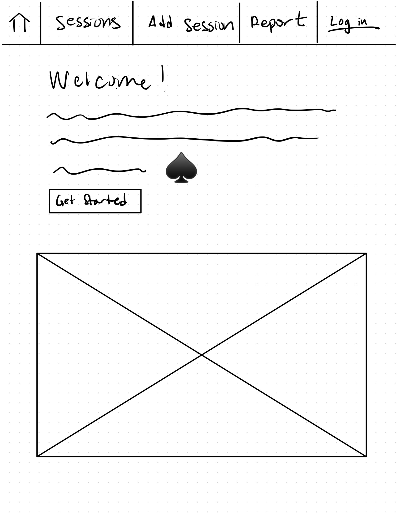
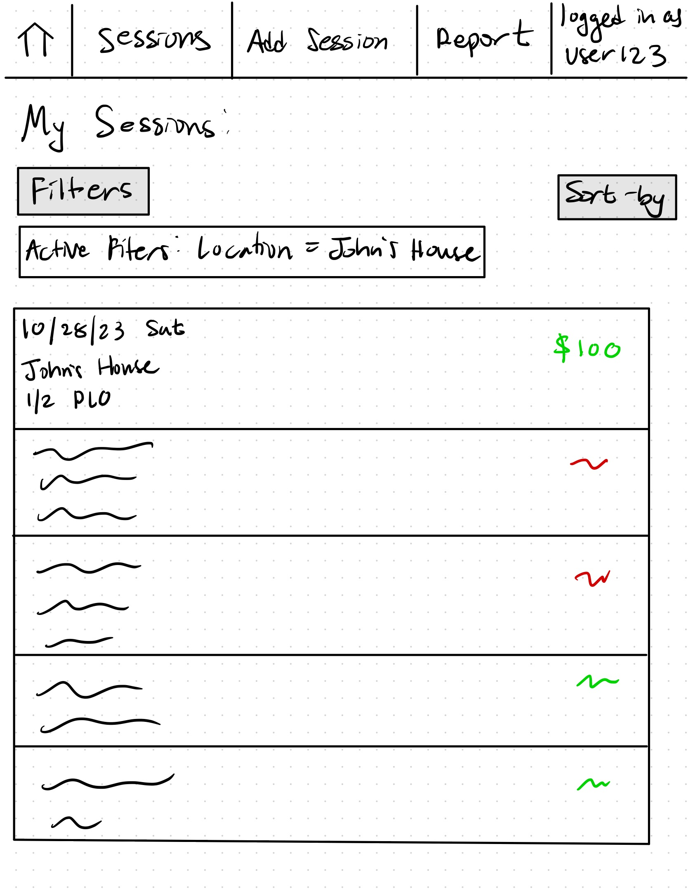
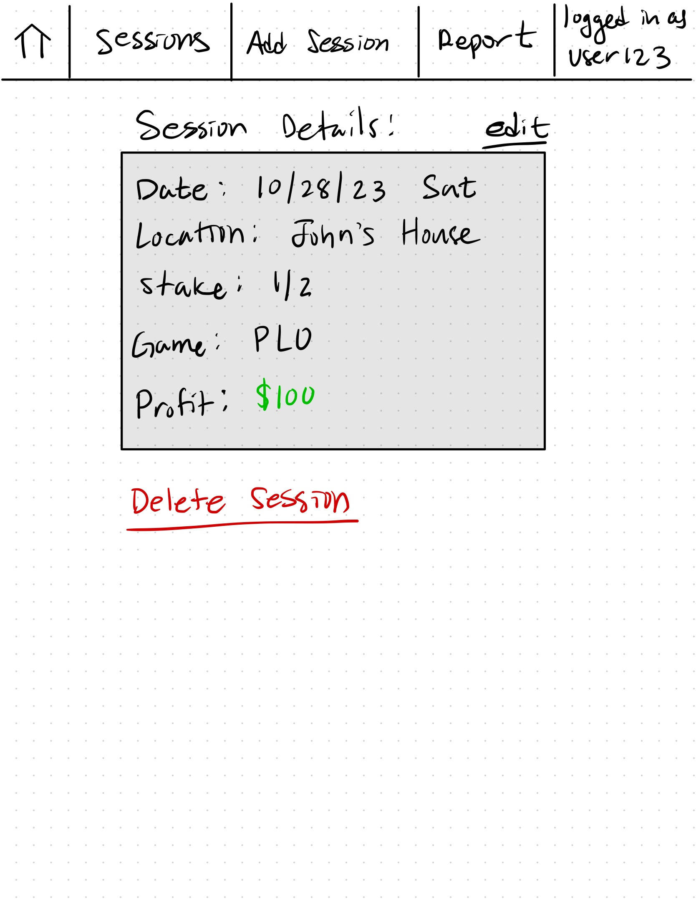
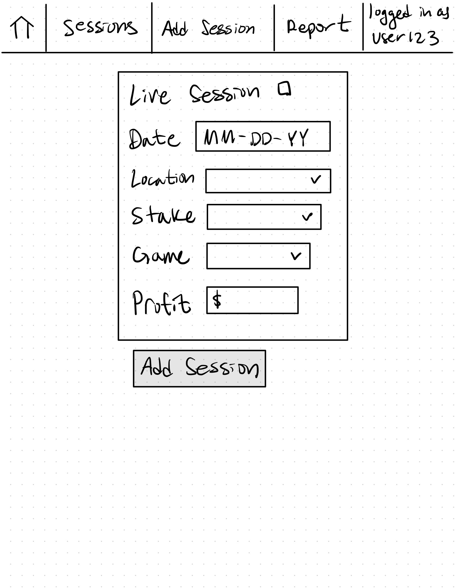
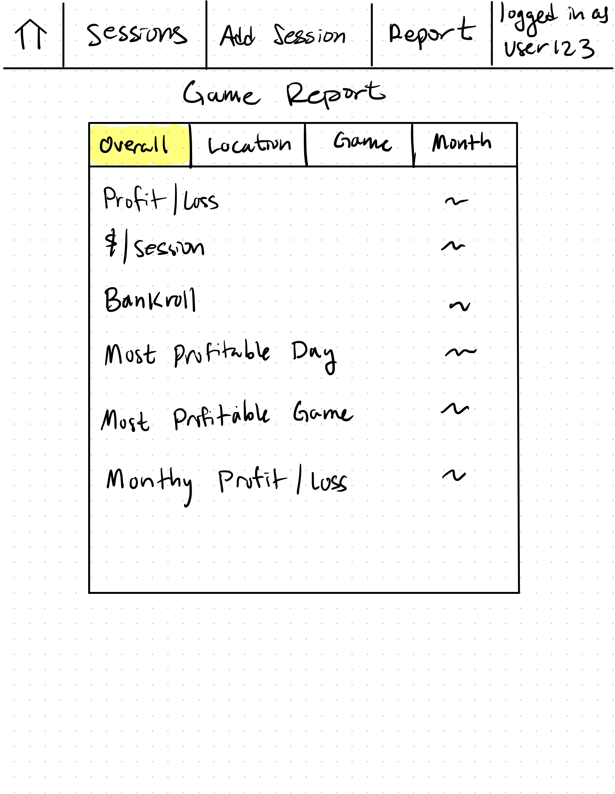
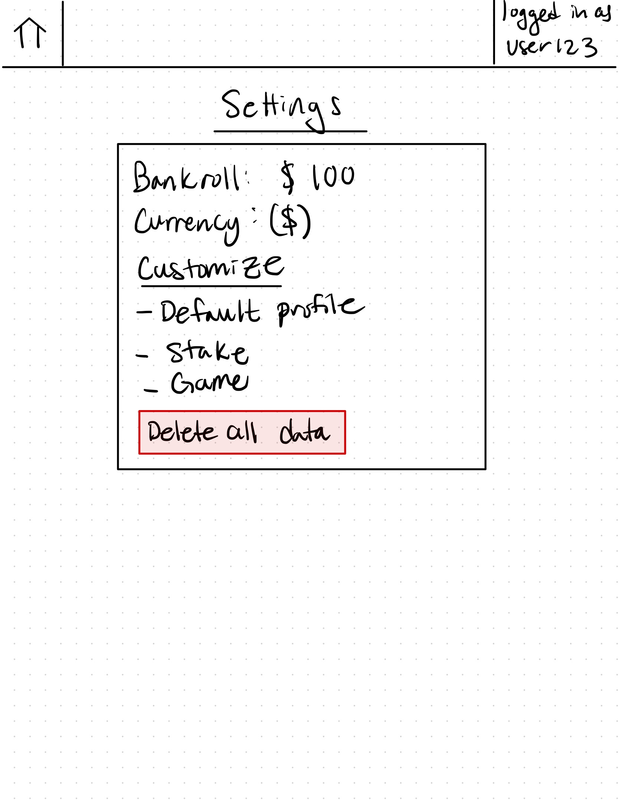
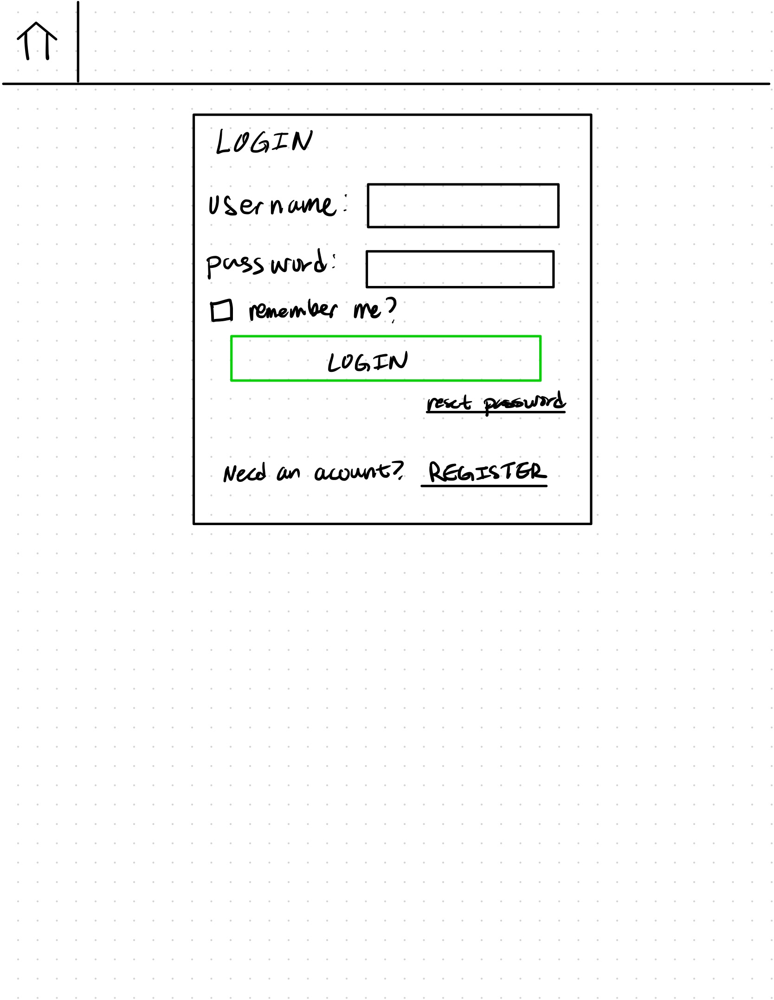
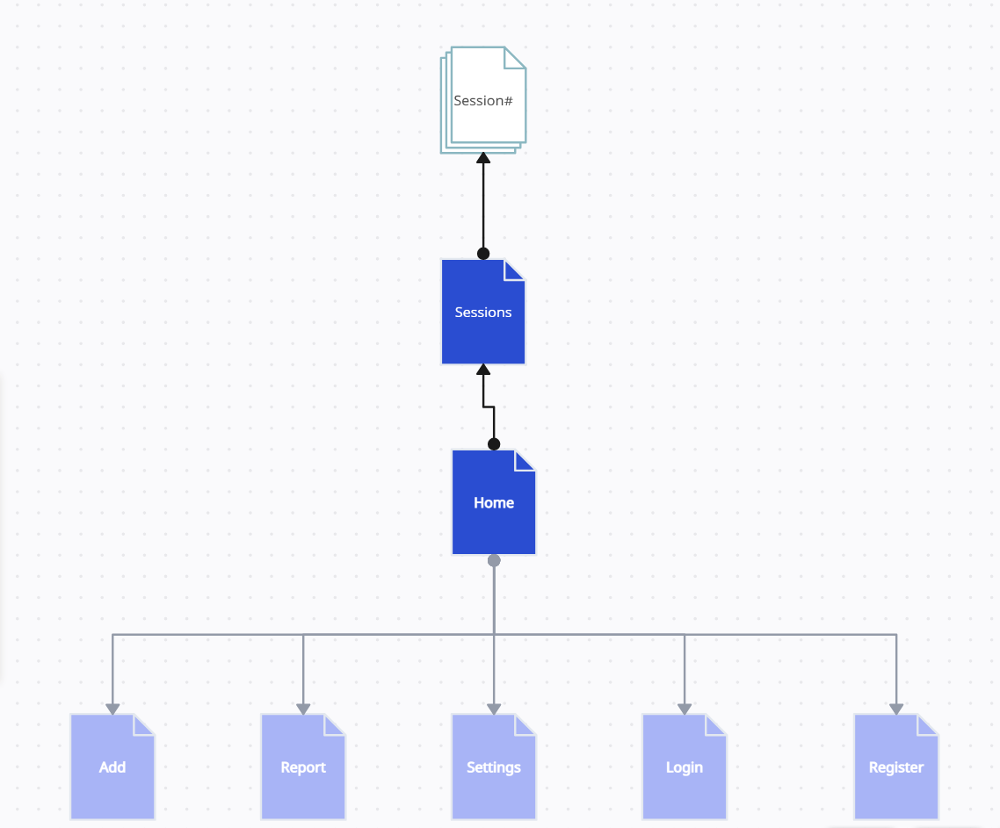

# Poker Tracker (updated partially for Milestone 2)

## Overview

Whether you play poker for fun with your friends or play professionally at the highest levels, it is helpful to keep track of your poker progress. 

Poker Tracker is a web app that allows users to keep track of their poker sessions in a simple format. Users can create an account, and immediately start logging their sessions. Users can filter their poker reports by location, game type, date, etc.

## Data Model

The application will store Users, Game Sessions, Game Type, Locations, Profits/Losses, Dates, and Blinds

* Users will have multiple game sessions stored by reference
* Game sessions will store the location, game type, blinds, date and time, profits/losses.

An Example User:

```javascript
{
  username: "TiltedFish",
  hash: // a password hash,
  gameSessions: // an array of references to GameSession ids
}
```

An Example Game Session with session details:

```javascript
{
  _id: "654c523b0a947810535927f"
  gameType: "PLO",
  blinds: "1/2",
  date: // reference to Date object,
  profit: 100
  location: "John's House"
}
```

## [Link to Commented First Draft Schema](server/models/sessionModel.js) 

## Wireframes

/home - page users are directed to when first entering the site



/sessions - page for displaying all of the user's logged sessions



/sessions/:sessionCode - page for showing specific session details



/add - page for creating a new poker session



/report - page for displaying a report summary of sessions



/settings - page for adjusting user settings



/login - page to login for existing users



/register - page to register as a user


## Site map



## User Stories or Use Cases

1. as non-registered user, I can register a new account with the site
2. as a user, I can log in to the site
3. as a user, I can log a poker session
4. as a user, I can view all of the sessions that I have logged
5. as a user, I can edit individual session details
6. as a user, I can filter sessions by date, location, stakes, and game type
7. as a user, I can manage my app settings to better fit my preferences
8. as a user, I can produce an overall report of game logs 


## Research Topics (UPDATED for Milestone 3)
* Front-end Framework (6 points)
    * A front-end framework is a JavaScript library that helps developers build user interfaces and web applications.
    * I decided to go with the MERN stack for my project
    * using React with Vite and Tailwind
* Vite (3 points)
    * Build tool and development server
    * Fast and efficient
* Tailwind (2 points)
    * CSS framework
    * Avoid writing CSS styles, apply classes directly in markup
* Axios
    * JS library for sending async HTTP requests to server
    * helpful for making API calls to server from front end
* User Authentication (6 points) -- NOT IMPLEMENTED YET
    * If the provided credential matches the stored value, the user is successfully authenticated, and access is granted.
    * I plan on researching Passport.js for my project

17 + ? points out of 10 required points

## [Link to Initial Main Project File](server/index.js) 

## Annotations / References Used

1. [basic tutorial for MERN stack](https://www.youtube.com/watch?v=-42K44A1oMA) - [inspiration for spinner and back button](frontend/src/components/Spinner.jsx)
2. [tutorial on hosting MERN app on Vercel](https://www.youtube.com/watch?v=Cfi0mymfKiA) - [link to vercel config](server/vercel.json)
3. [passport.js authentication docs](http://passportjs.org/docs) - (add link to source code that was based on this)
4. [axios guide](https://www.geeksforgeeks.org/axios-in-react-a-guide-for-beginners/)
5. [vite docs](https://vitejs.dev/)

