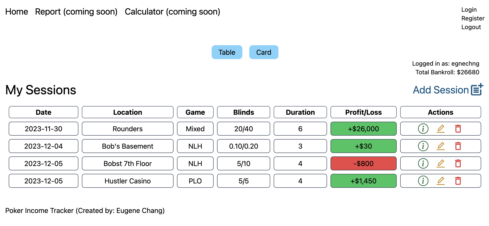
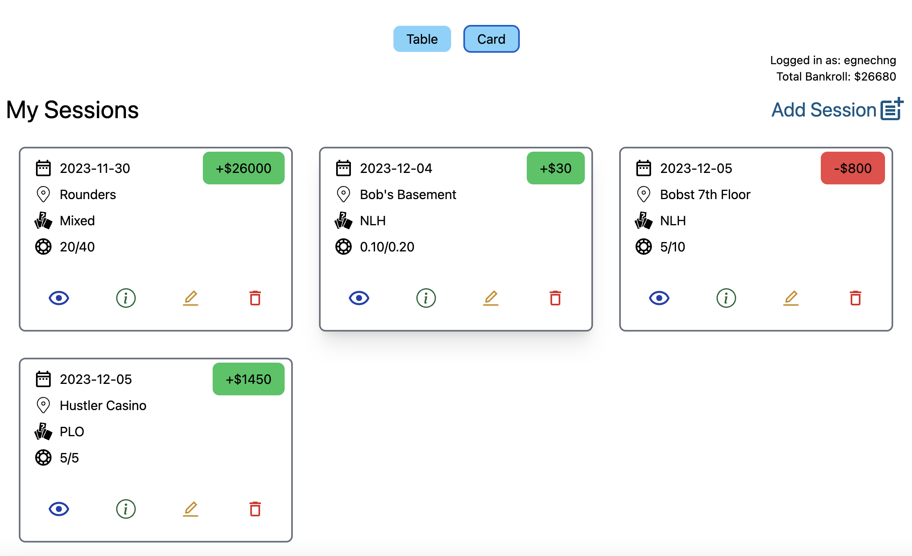
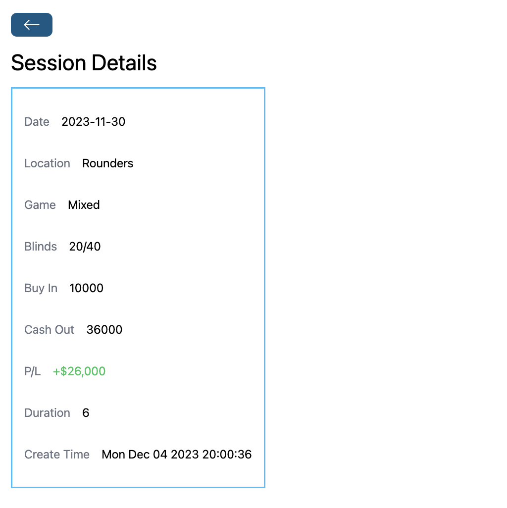
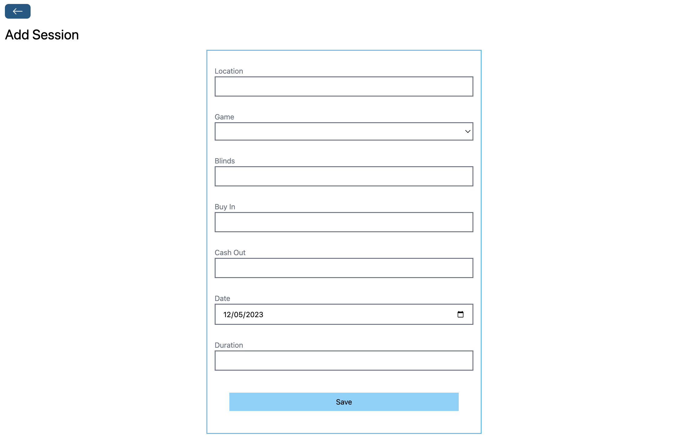
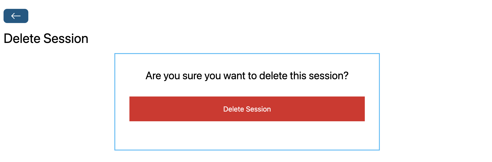
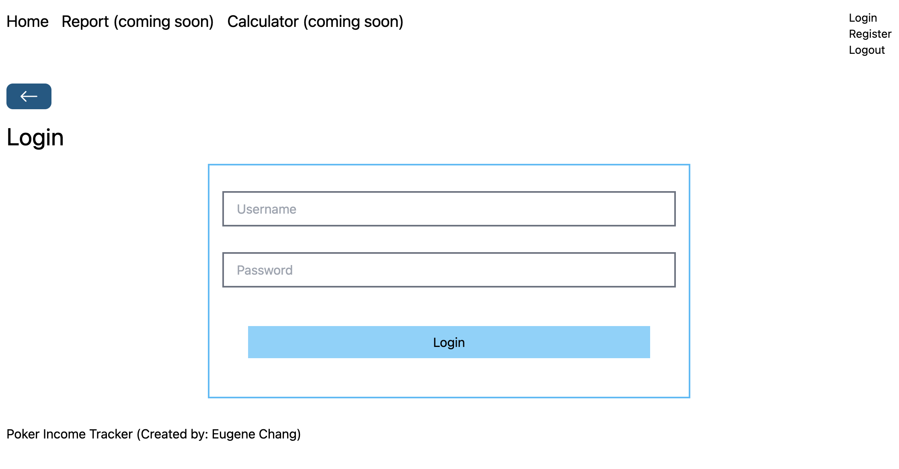
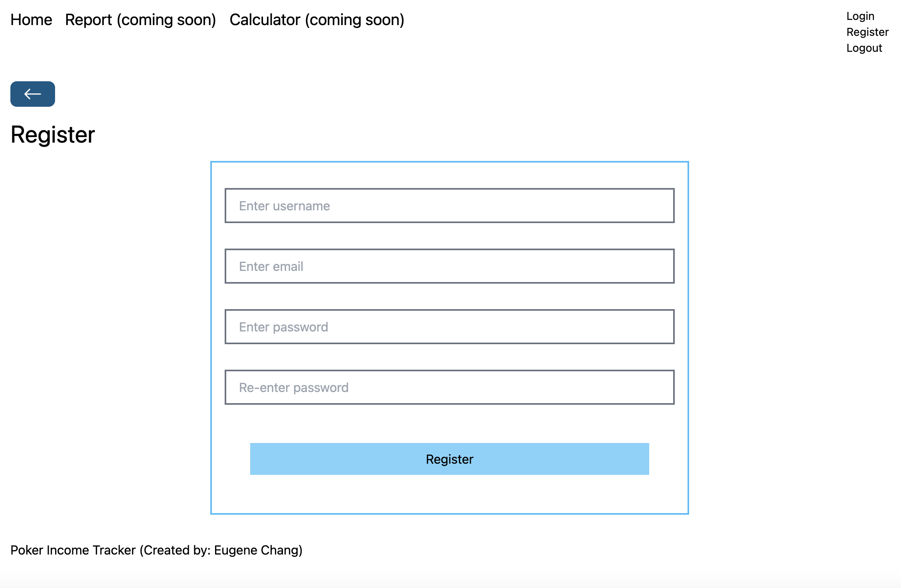
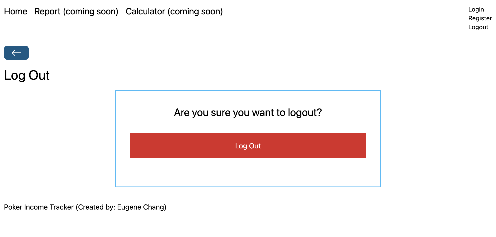
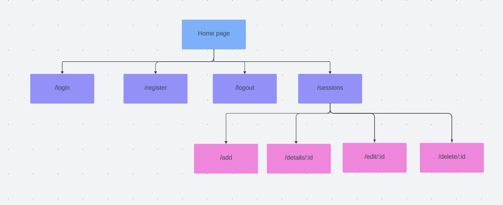

# Poker Tracker

## Overview

Whether you play poker for fun with your friends or play professionally at the highest levels, it is helpful to keep track of your poker progress. 

Poker Tracker is a web app that allows users to keep track of their poker sessions in a simple format. Users can create an account, and immediately start logging their sessions. Users can filter their poker reports by location, game type, date, etc.

## Data Model

The application will store Users and Game Sessions

* Users have a username, email associated with account and an encrypted password.
* Game sessions will store the location, game type, blinds, buyin/cashout, date, duration, location and owner user.

An Example User:

```javascript
{
  username: "TiltedFish",
  email: "tiltedfish@gmail.com",
  password: // a password hash,
}
```
## [Link to User Schema](server/models/userModel.js) 
An Example Game Session with session details:

```javascript
{
  gameType: "PLO",
  blinds: "1/2",
  buyIn: 100,
  cashOut: 200,
  date: 2023-10-30T00:00:00.000+00:00, // Date object
  duration: 2,
  location: "John's House",
  user: // reference to user object id
}
```
## [Link to Session Schema](server/models/sessionModel.js) 

## Wireframes (not updated since Milestone 3)

/ - home page that displays all of the user's logged sessions

Table View 


Card view


/sessions/details/:sessionID - page for viewing specific session details



/sessions/add - page for creating a new poker session



/sessions/edit/:sessionID - page for editing a session


/sessions/delete/:sessionID - page for deleting a session



/login - page to login for existing users



/register - page to register as a user



/logout - page to logout



## Site map



## User Stories or Use Cases

1. as non-registered user, I can register a new account with the site with a unique username and email
2. as a user, I can log in and log out from the site
3. as a user, I can log a poker session
4. as a user, I can view all of the sessions that I have logged in a Table of Card view
5. as a user, I can view, edit, and delete individual sessions
6. as a user, I can view my overall bankroll 


## Research Topics
* Front-end Framework
    * A front-end framework is a JavaScript library that helps developers build user interfaces and web applications.
    * I decided to go with the MERN stack for my project using React with Vite and Tailwind
* Vite
    * Provides a fast and efficient development environment, optimizes build
    * Easy to configure with React
* Tailwind
    * CSS framework for customizable and efficient styling
    * Avoid writing CSS styles, apply classes directly in markup
    * Improved performance
* Axios
    * JS library for sending async HTTP requests to server
    * Helpful for making API calls to server from front end
* User Authentication
    * Used JSON Web Token for user authentication
    * If the provided credential matches the stored value, the user is successfully authenticated, and access is granted.
    * Users can view and manipulate their own sessions

## [Link to Main Project File](server/index.js) 

## Annotations / References Used

1. [basic tutorial for MERN stack](https://www.youtube.com/watch?v=-42K44A1oMA) - [inspiration for spinner and back button and app theme](frontend/src/components/Spinner.jsx)
2. [tutorial on hosting MERN app on Vercel](https://www.youtube.com/watch?v=Cfi0mymfKiA) - [link to vercel config](server/vercel.json)
3. [JWT authentication](https://jwt.io/) - [link to authentication middleware](server/middleware/authMiddleware.js)
4. [axios guide](https://www.geeksforgeeks.org/axios-in-react-a-guide-for-beginners/)
5. [vite docs](https://vitejs.dev/) - [link to vite config](frontend/vite.config.js)
6. [tailwind docs](https://tailwindcss.com/) - [link to tailwind config](frontend/tailwind.config.js)

